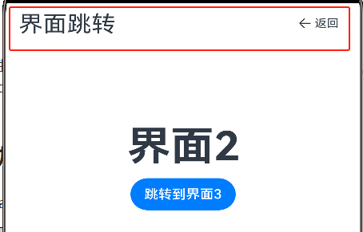

# HarmonyOS开发学习

##  1 ArkTs计划

1.1  了解项目结构 【完成】\
1.2  练习界面跳转 【完成】\
1.3  组件及自定义组件【完成】\
1.4  输入框 \
1.5  Icon使用和控制\
1.6  Row/Column布局 \
1.7  List组件\
1.8  Grid组件\
1.9  Tabs组件\
1.10 Resources使用\
1.11 弹出框及自定义弹出框\
1.12 基础动画\
1.13 本地数据保存 \
完结： Todo应用（增删改查）

## 2 更新备注
### 2023-11-26
1. 调整文件结构，重命名文件。
2. 统一使用头部控件

        
 
